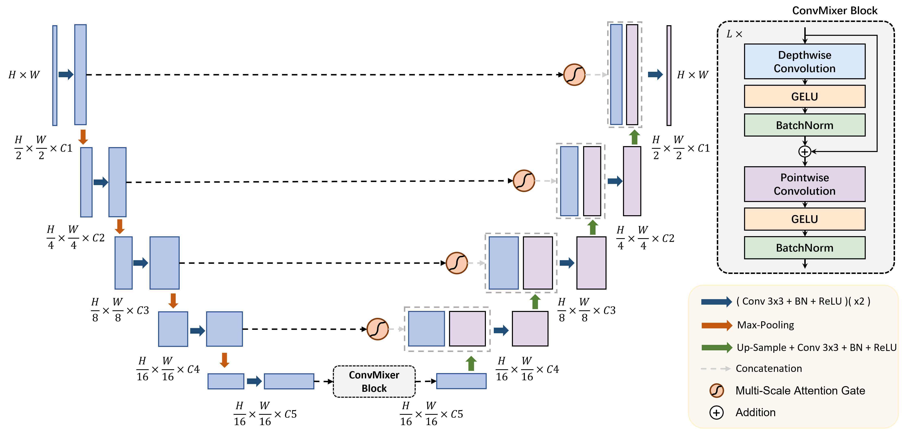
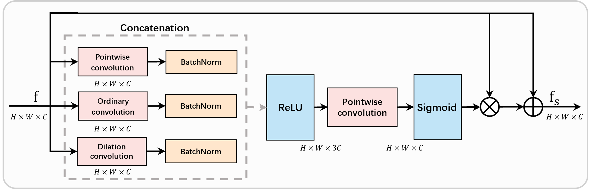

# CMU-Net: a strong ConvMixer-based medical ultrasound image segmentation network

[Paper](https://arxiv.org/abs/2210.13012)

[Code](https://github.com/FengheTan9/CMU-Net)

a Pytorch code base for [CMU-Net: A Strong ConvMixer-based Medical Ultrasound Image Segmentation Network](https://arxiv.org/abs/2210.13012)

## Introduction
U-Net and its extended segmentation model have achieved great success in medical image segmentation tasks. However, due to the inherent local characteristics of ordinary convolution operations, the encoder cannot effectively extract the global context information. In addition, simple skip connection cannot capture salient features. In this work, we propose a full convolutional segmentation network (CMU-Net) which incorporate hybrid convolution and multi-scale attention gate. The ConvMixer module is to mix distant spatial locations for extracting the global context information. Moreover, the multi-scale attention gate can help to emphasize valuable features and achieve efficient skip connections. Evaluations on open-source breast ultrasound images and private thyroid ultrasound image datasets show that CMU-Net achieves an average IOU of 73.27% and 84.75%, F1-value is 84.16% and 91.71%.





## Datasets

Please put the [BUSI](https://www.kaggle.com/aryashah2k/breast-ultrasound-images-dataset) dataset or your own dataset as the following architecture. 
```
├── CMUNet
    ├── inputs
        ├── BUSI
            ├── images
            |   ├── 0a7e06.jpg
            │   ├── 0aab0a.jpg
            │   ├── 0b1761.jpg
            │   ├── ...
            |
            └── masks
                ├── 0
                |   ├── 0a7e06.png
                |   ├── 0aab0a.png
                |   ├── 0b1761.png
                |   ├── ...
        ├── your dataset
            ├── images
            |   ├── 0a7e06.jpg
            │   ├── 0aab0a.jpg
            │   ├── 0b1761.jpg
            │   ├── ...
            |
            └── masks
                ├── 0
                |   ├── 0a7e06.png
                |   ├── 0aab0a.png
                |   ├── 0b1761.png
                |   ├── ...
```
## Environment

- GPU: NVIDIA GeForce RTX4090 GPU
- Pytorch: 1.13.0 cuda 11.7
- cudatoolkit: 11.7.1
- scikit-learn: 1.0.2

## Training and Validation

```
python main.py --dataset BUSI --name CMUnet --img_ext .png --mask_ext .png --lr 0.0001 --epochs 300 --input_w 256 --input_h 256 --b 8
```

## Acknowledgements:

This code-base uses helper functions from [UNeXt](https://github.com/jeya-maria-jose/UNeXt-pytorch).

## Citation

If you use our code, please cite our paper:

```
@INPROCEEDINGS{10230609,
  author={Tang, Fenghe and Wang, Lingtao and Ning, Chunping and Xian, Min and Ding, Jianrui},
  booktitle={2023 IEEE 20th International Symposium on Biomedical Imaging (ISBI)}, 
  title={CMU-Net: A Strong ConvMixer-based Medical Ultrasound Image Segmentation Network}, 
  year={2023},
  volume={},
  number={},
  pages={1-5},
  doi={10.1109/ISBI53787.2023.10230609}}
```

```
@article{tang2022cmu,
  title={CMU-Net: A Strong ConvMixer-based Medical Ultrasound Image Segmentation Network},
  author={Tang, Fenghe and Wang, Lingtao and Ning, Chunping and Xian, Min and Ding, Jianrui},
  journal={arXiv preprint arXiv:2210.13012},
  year={2022}
}
```

